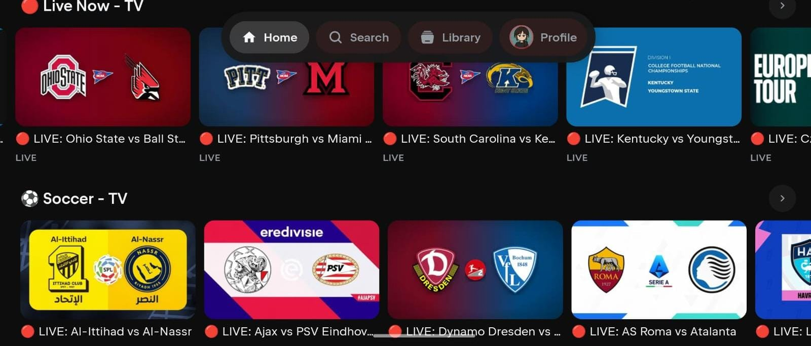
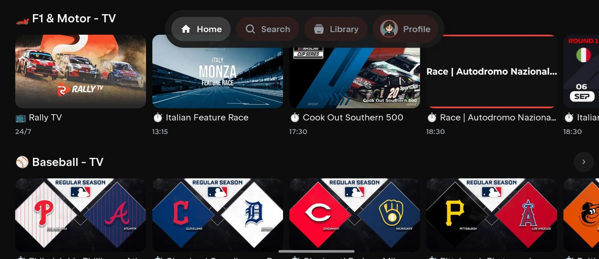
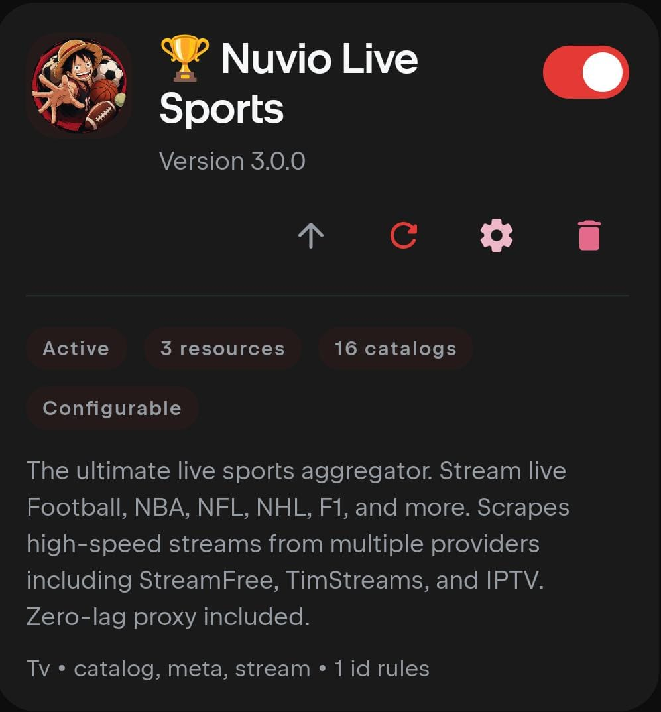

<p align="center">
  
</p>

# 🔴 Nuvio Live Sports Plugin

[](https://ko-fi.com/rajodedara)
[](https://github.com/rajhodedara/live-sport-plugin)
[](https://opensource.org/licenses/MIT)
[](#)

> ⚠️ **IMPORTANT HOSTING NOTICE:**
> **Do NOT deploy this addon to free/shared PaaS clouds like Render.com, Vercel, or Railway.** Their automated Acceptable Use Policy (AUP) scanners detect web scrapers and media proxying, which will result in **immediate and permanent suspension of your account**.
> 
> **Recommended setup:** Self-host on a spare PC / laptop / Raspberry Pi, or use a cheap unmanaged Linux VPS (e.g., Hetzner, DigitalOcean, Oracle Cloud Free Tier) using Docker or Cloudflare Tunnels (`cloudflared`).

> ☕ **Enjoying Nuvio Live Sports?** Consider [supporting the project on Ko-fi](https://ko-fi.com/rajodedara) to help cover maintenance, dedicated scrapers, and infrastructure!

A production-grade live sports streaming add-on for [Nuvio](https://nuvio.tv) and [Stremio](https://www.stremio.com/). It serves as a powerful multi-source aggregator that provides native live sports streams (Football, Basketball, Motorsport, Cricket, and more) inside your client, utilizing an advanced internal stream resolver to bypass CORS restrictions.

---

## 📱 App Preview & Screenshots

<p align="center">
  
</p>

| 🏎️ F1 & Baseball Catalogs | ⚡ 1080p Direct Stream Picker | ⚙️ Addon Details & Luffy Logo |
|:---:|:---:|:---:|
|  |  |  |

---

## 🚀 Self-Hosting Guides (Recommended)

### Option 1: Docker / Docker Compose (Easiest for Servers & Raspberry Pi)

Run the addon container in seconds:

```bash
# Clone the repository
git clone https://github.com/rajhodedara/live-sport-plugin.git
cd live-sport-plugin

# Start the container in background
docker compose up -d
```

The addon is now available at `http://localhost:7000` (or `http://YOUR_SERVER_IP:7000`).

---

### Option 2: Local Node.js (Same Wi-Fi / Local Network or Cloudflare Tunnel)

1. **Install and run the addon:**
   ```bash
   git clone https://github.com/rajhodedara/live-sport-plugin.git
   cd live-sport-plugin
   npm install
   npm run build
   npm start
   ```

2. **Access from other Devices on the Same Wi-Fi (Phone, TV, another Laptop):**
   - Find your host computer's local IPv4 address:
     - **Windows:** Open Command Prompt (`cmd`) and type `ipconfig` (look for `IPv4 Address`, e.g., `192.168.1.50`).
     - **Mac / Linux:** Open Terminal and type `ifconfig` or `ip a` (e.g., `192.168.1.50`).
   - On any phone/tablet/laptop connected to the same Wi-Fi, open your browser:
     ```
     http://<YOUR_IPV4_ADDRESS>:7000/configure
     ```
     *(Example: `http://192.168.1.50:7000/configure`)*
   - Configure your settings, copy the link, and paste into Nuvio / Stremio!

3. **(Optional) Expose Outside Home via Cloudflare Tunnel (`cloudflared`):**
   - Download [`cloudflared`](https://developers.cloudflare.com/cloudflare-one/connections/connect-networks/downloads/).
   - Run a quick tunnel:
     ```bash
     cloudflared tunnel --url http://127.0.0.1:7000
     ```
   - Open `https://your-tunnel-url.trycloudflare.com/configure` and install anywhere outside your home network!

*(Alternative: You can also use [Ngrok](https://ngrok.com) by running `ngrok http 127.0.0.1:7000`).*

---

### Option 3: Linux VPS with PM2 (Production 24/7)

```bash
# Clone and build
git clone https://github.com/rajhodedara/live-sport-plugin.git
cd live-sport-plugin
npm install
npm run build

# Install PM2 and start the service
npm install -g pm2
pm2 start dist/index.js --name "nuvio-sports"
pm2 save
pm2 startup
```

---

## ✨ Key Features

- **🏟️ Multi-Source Aggregator:** Combines matches and streams from multiple sources (StreamFree, Streamed.pk, BinTV, TimStreams, SportyHunter, WatchFooty, etc.) into a unified catalog.
- **⚡ Dynamic Host Routing:** Automatically generates manifest and stream URLs based on incoming request headers — works seamlessly behind Cloudflare, Ngrok, or custom domains.
- **🖼️ Built-in Image Proxy:** Proxies and normalizes thumbnails with SVG fallbacks to guarantee 100% visible posters across Stremio.
- **🛡️ Opossum Circuit Breakers:** Provider requests are isolated via circuit breakers to instantly fail-over if a streaming site goes down.
- **🧠 Algorithmic Stream Scoring:** Prioritizes high-resolution direct `.m3u8` links over external web players.
- **🌐 Built-in Stream Resolver:** Automatically bypasses CORS and referrer restrictions natively.
- **⚙️ Dynamic Configuration:** Features a responsive configuration page (`/configure`) to curate your favorite sports, teams, and timezones.

---

## 🛠️ Tech Stack

- **Runtime:** [Node.js](https://nodejs.org/) (v22+)
- **Framework:** [Express.js](https://expressjs.com/)
- **Scraping & DOM:** [Cheerio](https://cheerio.js.org/), [Happy DOM](https://github.com/capricorn86/happy-dom)
- **Dependency Injection:** [Awilix](https://github.com/jeffijoe/awilix)
- **Resilience:** [Opossum](https://nodeshift.dev/opossum/) (Circuit Breakers)
- **Addon SDK:** [stremio-addon-sdk](https://github.com/Stremio/stremio-addon-sdk)
- **Bundler:** [@vercel/ncc](https://github.com/vercel/ncc)

---

## 📋 Prerequisites

Before setting up the project locally:
- **Node.js**: Version 22.0.0 or higher
- **npm**: Installed with Node.js
- **Git**: For version control

---

## 🚀 Development Workflow

```bash
# Install dependencies
npm install

# Start development mode
npm run dev

# Build for production
npm run build

# Start production server
npm start
```

---

## 🎛️ Configuration Options

Through the local `/configure` UI, you can customize:
- **Sports:** Filter specific sports categories (e.g. Football, Basketball, Cricket, Motorsport, MMA, etc.).
- **Favorite Teams:** Add your favorite clubs/teams for priority tracking under the "⭐ Your Teams" tab.
- **Timezone:** Display match kick-off times in your exact local timezone.

---

## 🧪 Testing

The project includes unit, integration, and end-to-end simulation test suites.

```bash
# Run unit & integration tests
npm test

# Run simulated Stremio client E2E test
node scripts/test-e2e-simulated-client.js
```

